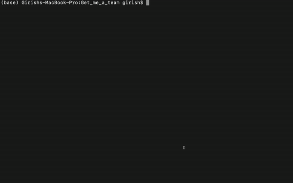
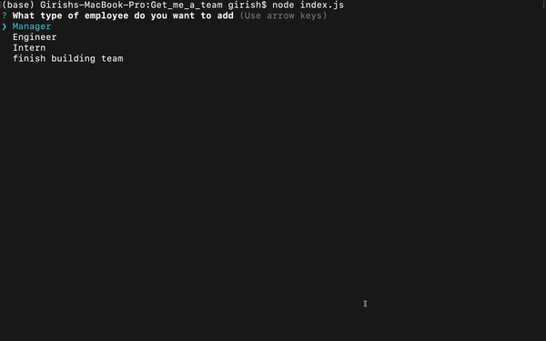

# Get_me_a_team

## Table of Contents
- [Task](#task)
- [Description](#description)
- [Installations](#installations)
- [Run](#run)
- [GIF](#gif)
- [Website](#website)
- [License](#license)

## Task
The purpose of this task was to create a Node.js command-line application that takes in information about employees on a software engineering team, then generates an HTML webpage that displays summaries for each person. Test files were to be created for code maintainability, and it was created for every part of the code.

## Description 
Questions would pop up on the command line once the application is executed. We have to selected a role of the employee to be added in the html, multiple employees can be added. We have to type in the employee's name id email and other questions are there for different roles, The questionnaire is through inquirer. After the information is got it is them push in the html by fs.writeFileSync. validations have been added to the questionnaire as well. The html document generated is in the dist folder named as index.html. Below is the demo of the application as well as the test cases.

## Installations
npm install

## Run
node index.js

## GIF

  
  
Fig 1: running the test cases

   

  
  
Fig 2: demo of the application

   

  
  
Fig 3: showing the validations

   

## Website
https://github.com/gmadnani/Get_me_a_team

https://github.com/gmadnani/Get_me_a_team/blob/main/dist/index.html

## License
[MIT](https://choosealicense.com/licenses/mit/)